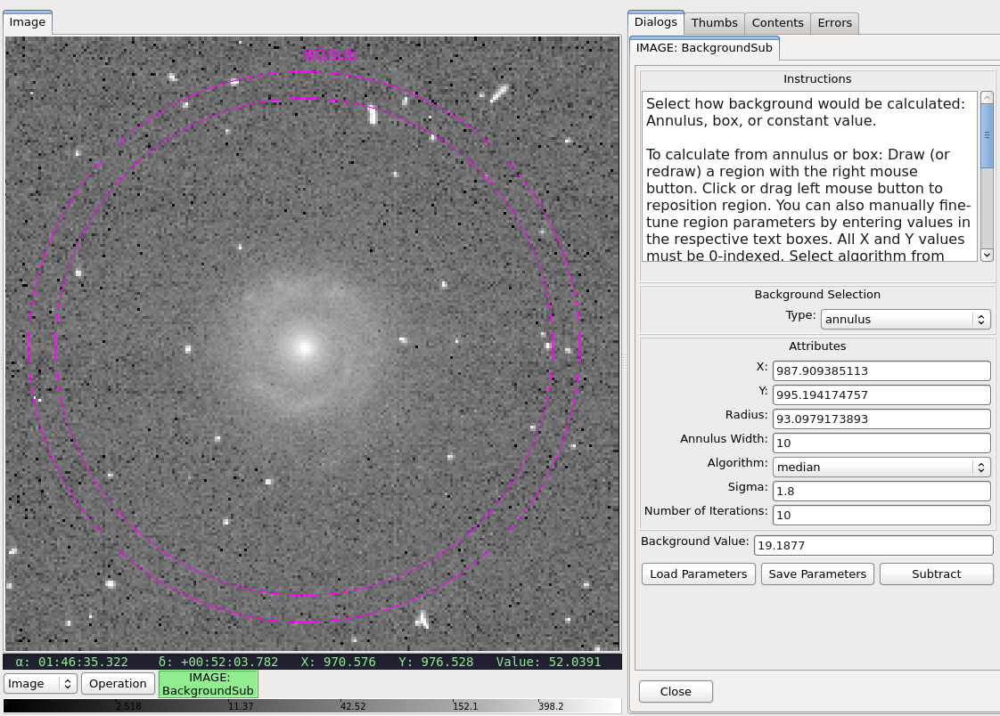
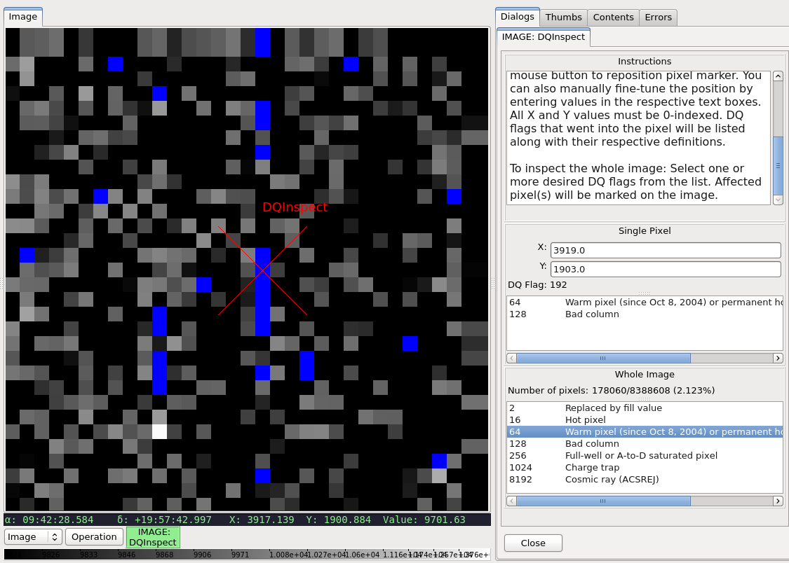
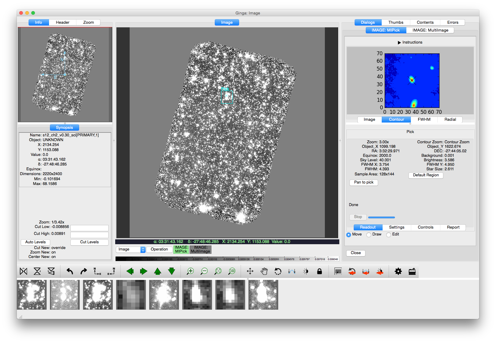

.. _stginga-plugins:

Plugins
=======

By using ``stginga``, the following plugins are also
available, in addition to the ones that already come with Ginga. Some are
customizable via plugin configuration files, which are available in the
`stginga/examples/configs <https://github.com/spacetelescope/stginga/tree/master/stginga/examples/configs>`_ directory.

.. _local-plugin-backgroundsub:

BackgroundSub
-------------

This local plugin is used to calculate and subtract background value. Currently,
it only handles constant background and there is no way to save the subtracted
image. However, subtraction parameters can be saved to a JSON file, which then
can be reloaded as well.

It is customizable using ``~/.ginga/plugin_BackgroundSub.cfg``::

  #
  # BackgroundSub plugin preferences file
  #
  # Place this in file under ~/.ginga with the name "plugin_BackgroundSub.cfg"

  # Color of the background region outline and label
  bgsubcolor = 'magenta'

  # Default background region properties. Can also be changed in the GUI.
  # bgtype can be 'annulus', 'box', or 'constant'
  bgtype = 'annulus'
  annulus_width = 10

  # Default calculation parameters. Can also be changed in the GUI.
  # algorithm can be 'mean', 'median', or 'mode'
  algorithm = 'median'
  sigma = 1.8
  niter = 10

  # If set to True, only use good pixels for calculations.
  # This is only applicable if there is an associated DQ extension.
  # Can also be changed in the GUI.
  ignore_bad_pixels = False

.. _global-plugin-changehistory:

ChangeHistory
-------------

This global plugin is used to log any changes to data buffer. For example,
a change log would appear here if background is subtracted off an image using
:ref:`local-plugin-backgroundsub` plugin.

It is customizable using ``~/.ginga/plugin_ChangeHistory.cfg``::

  #
  # ChangeHistory plugin preferences file
  #
  # Place this in file under ~/.ginga with the name "plugin_ChangeHistory.cfg"

  # If set to True, will always expand the tree in ChangeHistory when
  # new entries are added
  always_expand = True

  # If set to True, rows will have alternate colors
  color_alternate_rows = True

.. _local-plugin-dqinspect:

DQInspect
---------

This local plugin is used to inspect the associated DQ array of a given image.
It shows the different DQ flags that went into a given pixel (middle right)
and also the overall mask of the selected DQ flag(s) (bottom right).

It is customizable using ``~/.ginga/plugin_DQInspect.cfg``::

  #
  # DQInspect plugin preferences file
  #
  # Place this in file under ~/.ginga with the name "plugin_DQInspect.cfg"

  # Display long or short descriptions
  dqstr = 'long'

  # DQ definition files (JWST)
  dqdict = {'NIRCAM': 'data/dqflags_jwst.txt', 'NIRSPEC': ...}

  # Color to mark a single pixel for inspection
  pxdqcolor = 'red'

  # Color and opacity to mark all affected pixels
  imdqcolors = ['blue', 'magenta', 'green', ...]

.. _local-plugin-multiimage:

MultiImage
----------

This local plugin is used to view a selectable region of sky in multiple
images. A box on the image in the main display defines the right
ascension/declination region of sky to view. Along the bottom, postage
stamps of that same region from other images loaded into Ginga are
displayed. If the box size and position change, all the postage stamps
update dynamically.

.. image:: _static/multiimage_screenshot.png
  :width: 800px
  :alt: MultiImage plugin

Options include fixing the region either to sky coordinates, the
default, or to pixels (data). Standard editing controls over the box
are also available.

.. _local-plugin-mipick:

MIPick
------

This local plugin is mainly a demonstration on how custom plugins can be
integrated with existing plugins. This plugin is based on the
`Pick plugin <https://ginga.readthedocs.org/en/latest/manual/plugins.html#pick>`_.
However, the pick region, instead of being fixed to image
pixel coordinates, uses the image sky coordinates. If run with
:ref:`local-plugin-multiimage`, the postage stamps will show the same region
in different images.
Also, as images are cycled through the main viewer, the region
will automatically update, again always fixed on the same section of sky.

