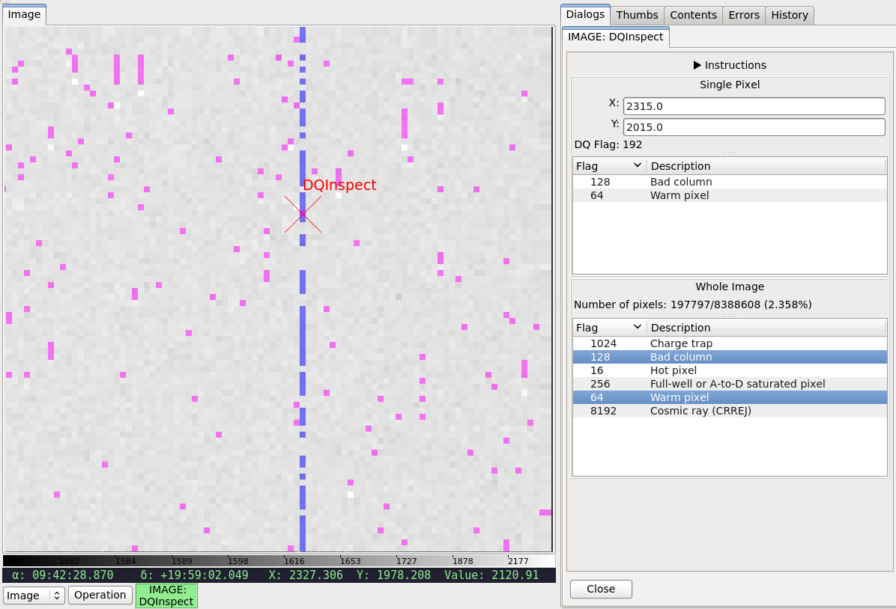

.. _local-plugin-dqinspect:

DQInspect
=========

This local plugin is used to inspect the associated DQ array of a given image.
It shows the different DQ flags that went into a given pixel (middle right)
and also the overall mask of the selected DQ flag(s) (bottom right).

It is customizable using ``~/.ginga/plugin_DQInspect.cfg``::

  #
  # DQInspect plugin preferences file
  #
  # Place this in file under ~/.ginga with the name "plugin_DQInspect.cfg"

  # Display long or short descriptions
  dqstr = 'long'

  # DQ definition files (JWST)
  dqdict = {'NIRCAM': 'data/dqflags_jwst.txt', 'NIRSPEC': ...}

  # Color to mark a single pixel for inspection
  pxdqcolor = 'red'

  # Colors to mark all affected pixels
  imdqcolors = ['blue', 'magenta', 'green', ...]
