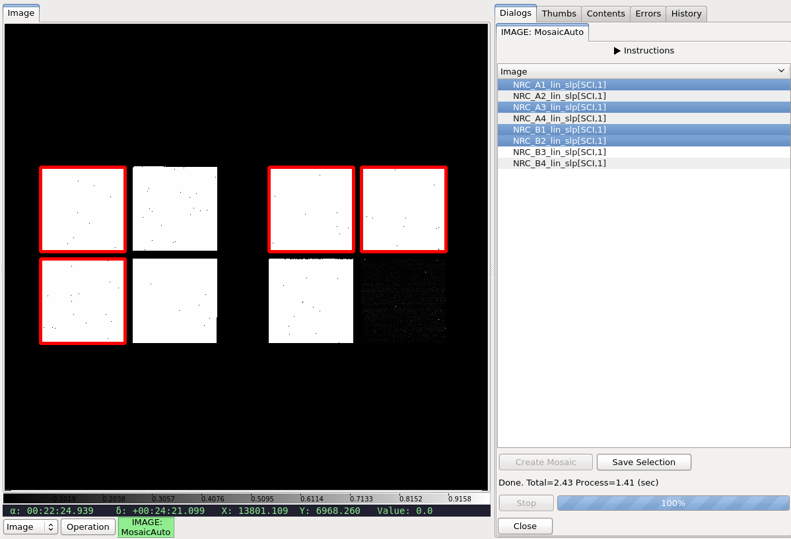

.. _local-plugin-mosaicauto:

MosaicAuto
==========

.. warning:: This can be very memory intensive.

This local plugin is used to automatically create a mosaic of all currently
loaded images in the channel. The position of an image on the mosaic is
determined by its WCS without distortion correction. This is meant as a
quick-look tool, not an
`AstroDrizzle <http://ssb.stsci.edu/doc/stsci_python_x/drizzlepac.doc/html/index.html>`_
replacement. Currently, such a mosaic can only be created once per Ginga
session. Once the mosaic is successfully created, user can select the desired
image name(s) to highlight associated footprint(s) on the mosaic. User can also
save an image list of the selected image(s).

It is customizable using ``~/.ginga/plugin_Mosaic.cfg``, which is the same file
used for Ginga's core ``Mosaic`` plugin. Here, only the critical parameters or
the ones with values that are different from Ginga's default are listed::

  #
  # Mosaic plugin preferences file
  #
  # Place this in file under ~/.ginga with the name "plugin_Mosaic.cfg"

  # default FOV for new mosaics
  fov_deg = 0.1

  # Try to match backgrounds
  match_bg = True

  # Number of threads to devote to opening images
  # NOTE: This depends on how many cores your machine has!
  num_threads = 12

  # Maximum delta from center of image (in deg) beyond which new images
  # are assumed to start a new mosaic. Set to None if you never want this
  # behavior
  max_center_deg_delta = None

  # Allow mosaic images to create thumbnail entries
  make_thumbs = True

  # MosaicAuto only -- Control how footprints are highlighted.
  # Line width must be a number from 1-20.
  footprintscolor = 'red'
  footprintlinewidth = 5
