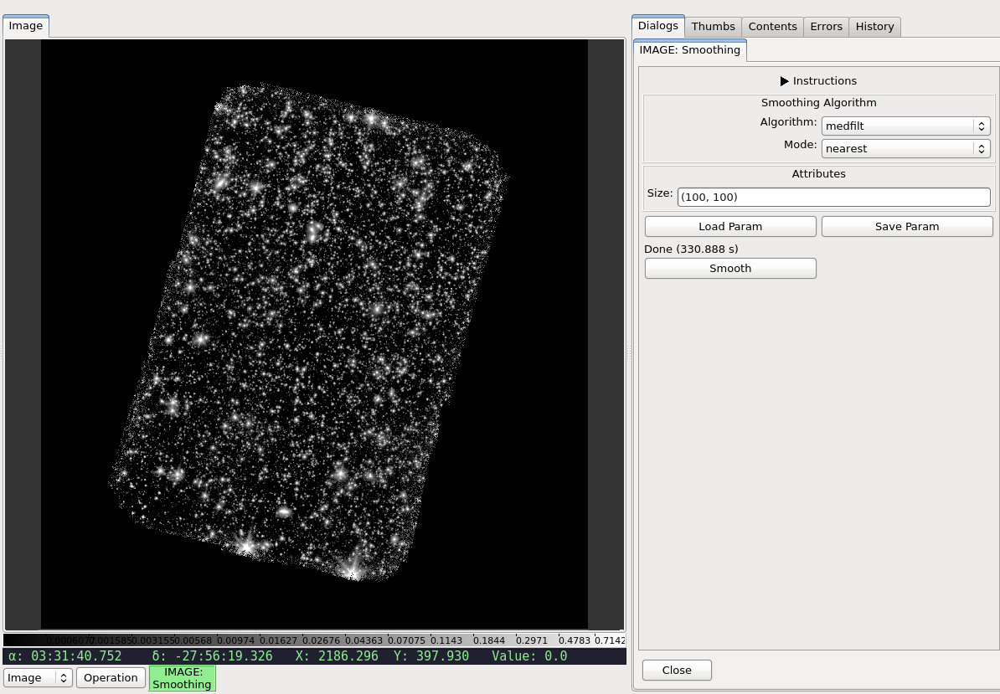

.. _local-plugin-smoothing:

Smoothing
---------

.. image:: images/smoothing_after.png
  :width: 800px
  :alt: Smoothing plugin, after

This local plugin is used to smooth the chosen image using one of the following
algorithms:

=========== ============================================ ========================================
Algorithm   Description                                  Function
=========== ============================================ ========================================
``boxcar``  Convolve image with normalize boxcar kernel. `~scipy.ndimage.filters.convolve`
``gauss``   Apply a Gaussian filter.                     `~scipy.ndimage.filters.gaussian_filter`
``medfilt`` Apply a median filter.                       `~scipy.ndimage.filters.median_filter`
=========== ============================================ ========================================

Once user has selected the algorithm and entered the appropriate parameter
values, smoothing is done by clicking the "Smooth" button.

.. note:: The actual smoothing process might be time and resource intensive.

The smoothed image is inserted into Ginga as a new image, leaving the original
image untouched. Details on the smoothing performed can be viewed using
:ref:`sec-plugins-changehistory`. In addition, it can be saved using
:ref:`local-plugin-saveimage`.

It is customizable using ``~/.ginga/plugin_Smoothing.cfg``::

  #
  # Smoothing plugin preferences file
  #
  # Place this in file under ~/.ginga with the name "plugin_Smoothing.cfg"

  # Smoothing algorithm -- 'boxcar', 'gauss', or 'medfilt'
  algorithm = 'boxcar'

  # Kernel size or shape
  smoothpars = (100, 100)

  # Mode for smoothing -- 'reflect', 'constant', 'nearest', 'mirror', or 'wrap'
  # See scipy.ndimage.filters doc for more details.
  mode = 'nearest'

  # Fill value that is only used when mode is 'constant'
  fillval = 0.0
