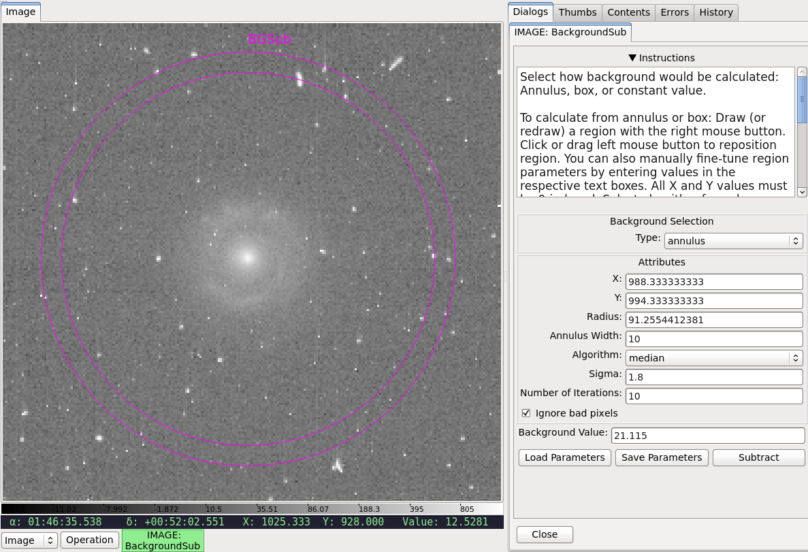

.. _local-plugin-backgroundsub:

BackgroundSub
=============

This local plugin is used to calculate and subtract background value. Currently,
it only handles constant background. Subtraction parameters can be saved to a
JSON file, which then can be reloaded as well. The subtracted image can be saved
using :ref:`ginga:sec-plugins-global-saveimage`.

.. automodule:: stginga.plugins.BackgroundSub
