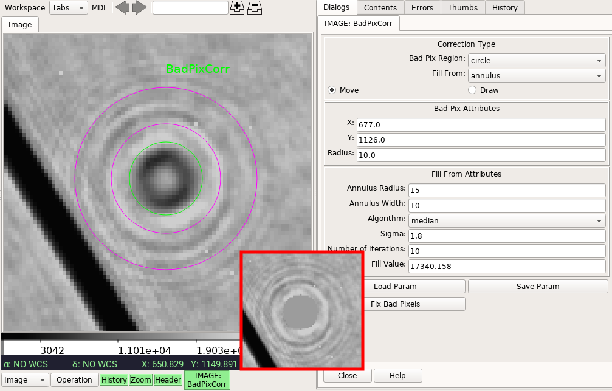

.. _local-plugin-badpixcorr:

BadPixCorr
==========

This local plugin is used to fix bad pixels. Currently, it only handles fixing
a single bad pixel or bad pixels within a circular region. The corresponding
DQ flags will also be set to the given new flag value (default is zero).
Correction parameters can be saved to a JSON file, which then can be reloaded
as well. The corrected image can be saved using
:ref:`ginga:sec-plugins-global-saveimage`.

.. automodule:: stginga.plugins.BadPixCorr
