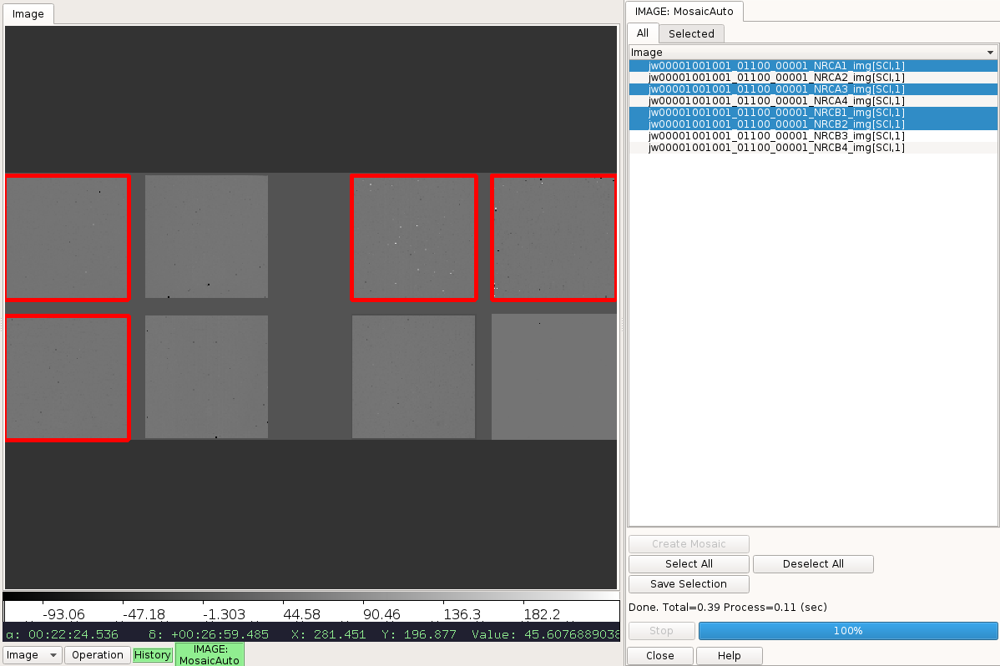

.. _local-plugin-mosaicauto:

MosaicAuto
==========

.. warning:: This can be very memory intensive.

This local plugin is used to automatically create a mosaic of all currently
loaded images in the channel. The position of an image on the mosaic is
determined by its WCS without distortion correction. This is meant as a
quick-look tool, not an
`AstroDrizzle <http://ssb.stsci.edu/doc/stsci_python_x/drizzlepac.doc/html/index.html>`_
replacement. Currently, such a mosaic can only be created once per Ginga
session.

Once the mosaic is successfully created, user can select the desired
image name(s) to highlight associated footprint(s) on the mosaic.
Alternately, user can also click directly on the displayed mosaic to
highlight a footprint; Clicking on a highlighted footprint again will
un-highlight it.

A shortlist of only the selected image names are displayed under the "Selected"
tab. This list can be saved to a file by clicking "Save Selection" button.
Optionally, the mosaic itself can be saved using
:ref:`ginga:sec-plugins-global-saveimage`.

.. automodule:: stginga.plugins.MosaicAuto
