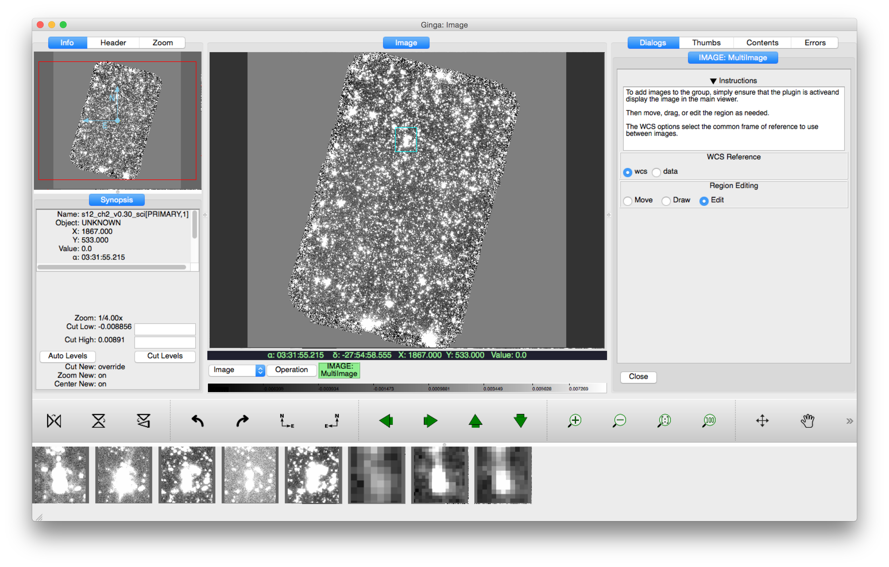

.. _local-plugin-multiimage:

MultiImage
==========

.. warning:: This is experimental; not actively maintain and might not work.

This local plugin is used to view a selectable region of sky in multiple
images. A box on the image in the main display defines the right
ascension/declination region of sky to view. Along the bottom, postage
stamps of that same region from other images loaded into Ginga are
displayed. If the box size and position change, all the postage stamps
update dynamically.

Options include fixing the region either to sky coordinates, the
default, or to pixels (data). Standard editing controls over the box
are also available.
