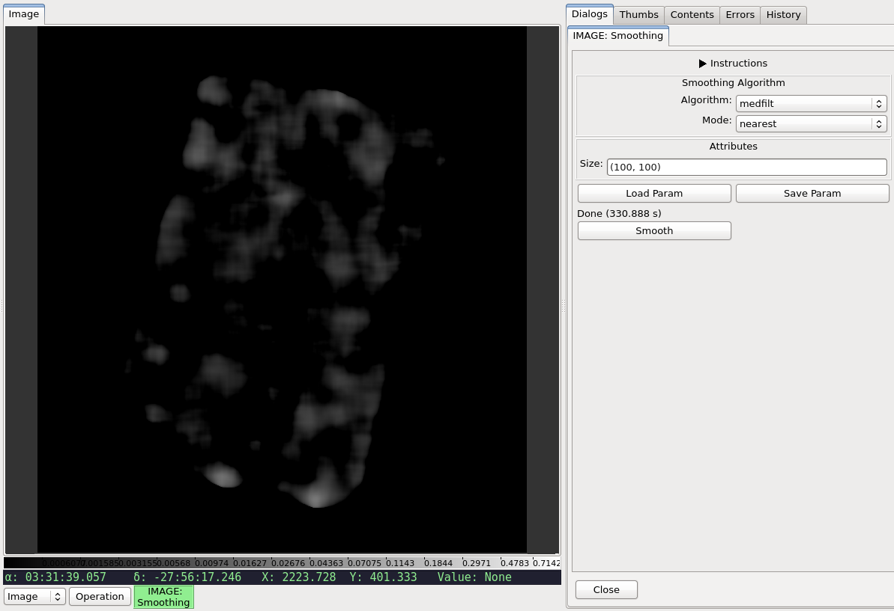

.. _local-plugin-smoothing:

Smoothing
---------

.. warning:: This is experimental; not actively maintain and might not work.

.. image:: images/smoothing_before.png
  :width: 800px
  :alt: Smoothing plugin, before

This local plugin is used to smooth the chosen image using one of the following
algorithms:

=========== ============================================ ======================================
Algorithm   Description                                  Function
=========== ============================================ ======================================
``boxcar``  Convolve image with normalize boxcar kernel. :func:`~scipy.ndimage.convolve`
``gauss``   Apply a Gaussian filter.                     :func:`~scipy.ndimage.gaussian_filter`
``medfilt`` Apply a median filter.                       :func:`~scipy.ndimage.median_filter`
=========== ============================================ ======================================

Once user has selected the algorithm and entered the appropriate parameter
values, smoothing is done by clicking the "Smooth" button.

.. note:: The actual smoothing process might be time and resource intensive.

The smoothed image is inserted into Ginga as a new image, leaving the original
image untouched. Details on the smoothing performed can be viewed using
:ref:`ginga:sec-plugins-changehistory`. In addition, it can be saved using
:ref:`ginga:sec-plugins-global-saveimage`.

.. automodule:: stginga.plugins.Smoothing
