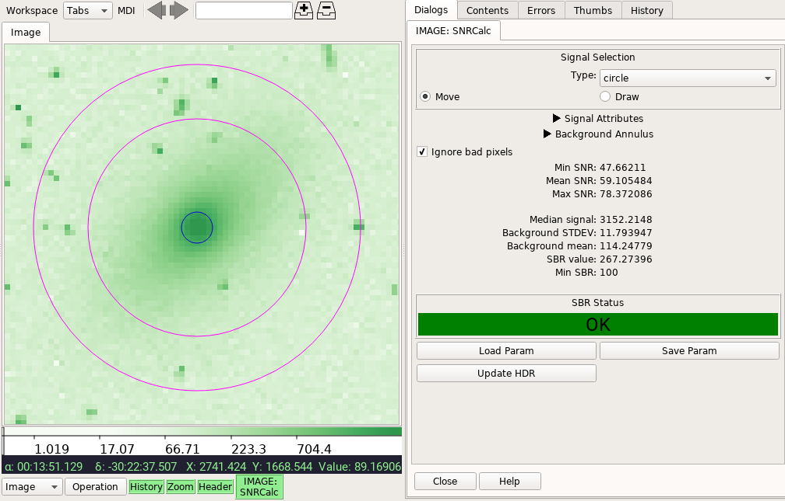

.. _local-plugin-snrcalc:

SNRCalc
-------

This local plugin is used to calculate the surface-to-background ratio (SBR)
and the signal-to-noise ratio (SNR), as follow.

SBR is as defined by `Ball <http://www.ballaerospace.com/>`_, *"Take the median
value of the pixels within the image. In the case of a defocused spot, this is
just the median value within the 'top hat' portion of the image. Next, take the
standard deviation of the pixels that are clearly in the background, that is,
have no incident photons on them. Take the ratio of these two quantities, and
you have the signal-to-background ratio."*

Given selected science (:math:`S`) and background (:math:`B`) regions:

.. math::

    \mathrm{SBR} = \frac{\mathrm{MEDIAN}(S)}{\mathrm{STDEV}(B)}

For the science region above, as long as the image has an accompanying error
array (e.g., the ``ERR`` extension), its SNR can also be calculated:

.. math::

    a = \frac{S}{\mathrm{ERR}}

    \mathrm{SNR}_{\mathrm{min}} = \mathrm{MIN}(a)

    \mathrm{SNR}_{\mathrm{max}} = \mathrm{MAX}(a)

    \overline{\mathrm{SNR}} = \mathrm{MEAN}(a)

While SNR is more popular, SBR is useful for images without existing or
reliable errors. User can also define a minimum limit for SBR check, so that
the GUI can provide a quick visual indication on whether the image achieves the
desired SBR or not. As part of the statistics, mean background value is also
provided albeit not used in SBR nor SNR calculations.

User can save the calculated values in the image header using the "Update HDR"
button. Calculation parameters can be saved to a JSON file, which then can be
reloaded as well. The image with updated header can be saved using
:ref:`ginga:sec-plugins-global-saveimage`.

.. automodule:: stginga.plugins.SNRCalc
